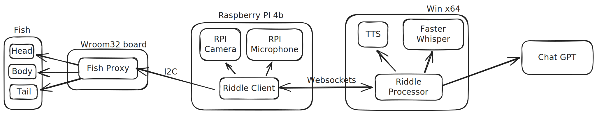
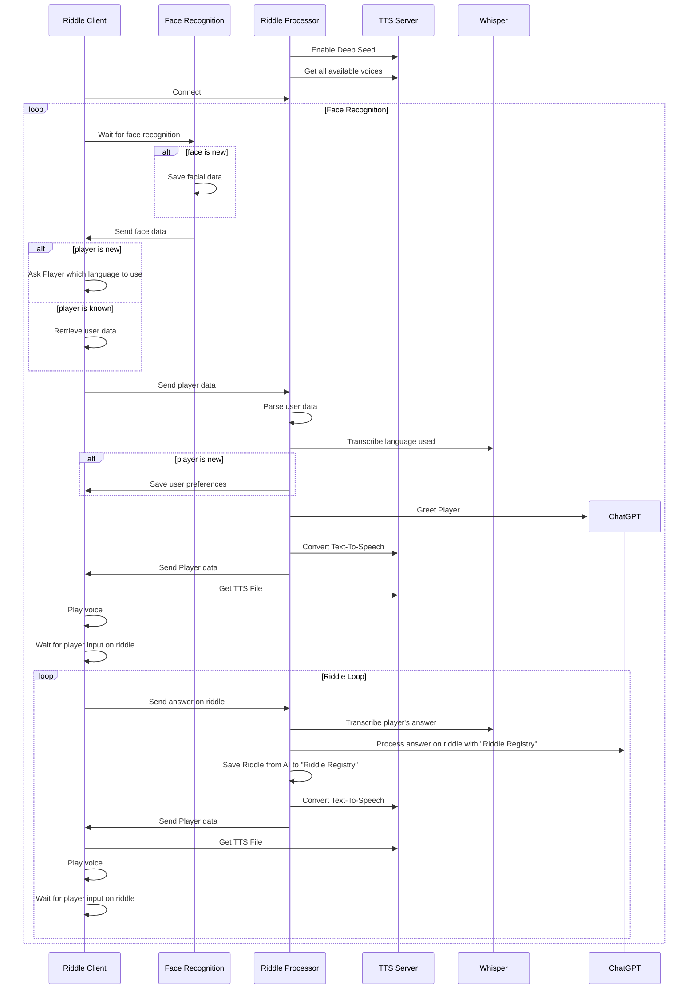

# Fish Riddles - AI powered Fish-formed Riddle-maker

> NOTE: Ahoy! This project consists of several parts. If, by any reason, you decided "I want to build something like this" I'll try to document as much as I can.

## Demo
Here is a short demo showing the interaction with the fish.

https://youtu.be/fznJSKNcpw8

## Details about components
### Riddle Processor

The *main* part of this project is a __Riddle Processor__.  
It's essentially a Websocket server which:  
* Handle communication with __Riddle Client__ running on __Raspberry PI 4b__
* Transcribe received WAV files captured from the microphone by __Riddle Client__ using [Faster Whisper](https://github.com/SYSTRAN/faster-whisper)
* Send requests to the __Chat GPT__ to make Riddles a bit more interactive than just _riddles_.
* Convert text-to-speech using local instance of the [All-Talk TTS](https://github.com/erew123/alltalk_tts)
* Keeps history of conversations to supply it with Player response on Riddle
* Maintains "Riddle Registry" - list of already made Riddles, stored per language
    * AI tend to answer the same Riddles on essentially the same prompt - so we supply our list of riddles so it less likely repeat itself

### Riddle Client

The __Riddle Client__ runs on the Raspberry PI and perform the following tasks:
* Connects to __Riddle Processor__
* Continuously wait for the __Age Classifier__ to get information about The Player via the Camera module: is it new one, old one, and how old they are?
* Player is not recognized anymore? Transition to Idle.
* Capture Player's voice.
* Control Fish puppet via **Fish Proxy** over I2C.

### Fish Proxy

__Fish Proxy__ is proxy component providing [I2C](https://en.wikipedia.org/wiki/I²C) interface for __Riddle Client__ to control Fish body: Head, Tail, and Mouth:
* Proxy is running on ESP-Wroom32 Dev board and listen on a bus on address __0x08__
* It's continuously waiting for a command via i2c and either execute a command (like TAIL_UP, TAIL_DOWN, etc) or provide status of executing of this commands
* Additionally, it's hooked up with original Fish IC in such a way that all previous "singing" fish logic kept as it was before - _if fish wants to sing, nothing will stop it_! Technically it's done via hooking up interrupts on 3 pins of Fish IC - Fish Proxy will then just forward signals to the motors.


### Component diagram


### Sequence diagram



## How to wire it

### Wiring

- Fish IC is the original IC made for this fish puppet - it's role is to sing a song if button pressed and to move head/tail/mouth.
- I traced where IC is driving motors and hijacked PCB:
    - Signals from the IC goes directly to the interrupt pins on Wroom.
    - If interrupt pins are driven - then signals goes unmodified by proxying it to the motor pins (in this way original singing/movement mode still will be there after I remove Raspberry Pi).
    - I have to do additional modification on the Fish PCB - install [Pull-down](https://www.electronics-tutorials.ws/logic/pull-up-resistor.html) resistors between **ground** and each of output pins to the transistors for Mouth/Tail/Head. This is needed to prevent floating of the transistor bases when they are not driven by Wroom.
- **⚠ Please note that the original fish PCB is 5V (TTL logic)!** I have to install logic-level converter between original IC and Wroom (which is 3V3). Without it, there is a significant risk to burn Wroom GPIOs since they are not designed to tolerate 5V.
- However, I output only 3V3 from the Wroom32 - it's enough to drive 5V TTL logic for tail/mouth/head:
    - Head/Tail controlled via bases of the [H-Bridge](https://en.wikipedia.org/wiki/H-bridge#:~:text=An%20H%2Dbridge%20is%20an,to%20run%20forwards%20or%20backwards.) - they marked as a HEAD/TAIL on the diagram below.
    - **⚠ Under no circumstances you should drive HEAD and TAIL at the same time! Doing so, will result in short-circuiting your VCC to GND via transistors and will damage the fish!**
- Regulator 5V->3V3 500mA is installed to supply voltage to the Logic level converter.
- Wroom supplied via VIN pin on the board from 5V. It then regulates it to 3V3 via onboard regulator.
- 2 KY-019 5V relay modules used to switch output from IC one to Rpi one.
- Rpi audio output is connected to the LM386 10W audio amplifier. It's done because sound produced by RPI is barely heard on built-in 4 Ohm speaker of the fish.
- Microphone used by Rpi is not shown, it's connected via USB Audio card to the RPI.


### Wiring schematic


## How to run it

### Riddle Client
#### Prerequisites

- Python >= 3.12
- I2C enabled via `raspi-config`

#### Installation

Execute the following commands on the Raspberry PI:
```sh
git clone git@github.com:PheonixS/FishRiddles.git
cd FishRiddles
# create new .env file in RiddleClient directory and put there actual data for RIDDLE_PROCESSOR_URL="http://IP:PORT"
make RiddleClient
```

This will install Python virtual environment and download necessary models.

To install Fish Client as a service, you need to run the following:
```sh
# enable Lingering for the user so systemd services are active if no user session is active
# https://wiki.archlinux.org/title/Systemd/User
sudo loginctl enable-linger $USER
make RiddleClient-daemon-install
```

It will install User-level systemd and start Riddle Client service.

### Fish Proxy
### Prerequisites

- Wroom32 dev kit
- USB cable
- VScode with PlatformIO extension

#### Installation

- Open Fish Proxy folder in the PlatformIO
- Connect Wroom32 to PC
- Upload program to the Wroom32.

### Riddle Processor
### Prerequisites

- Nvidia GPU - I tested on Nvidia Geforce 3070 8Gb.
- [Alltalk TTS](https://github.com/erew123/alltalk_tts) instance running locally with [exposed API for the local network](https://github.com/erew123/alltalk_tts/tree/main?tab=readme-ov-file#-changing-alltalks-ip-address--accessing-alltalk-over-your-network).
- Faster whisper dependencies, see [here](https://github.com/erew123/alltalk_tts/tree/main?tab=readme-ov-file#-changing-alltalks-ip-address--accessing-alltalk-over-your-network).
- [Miniconda](https://docs.conda.io/projects/conda/en/latest/user-guide/install/windows.html)

#### Installation

- Activate Anaconda prompt from start menu
- Go the the project folder you cloned
- Create `config.json` in RiddleProcessor directory
```json
{
    "api_alltalk_protocol": "http://",
    "api_alltalk_ip_port": "127.0.0.1:7851",
    "api_alltalk_external_protocol": "http://",
    "api_alltalk_external_ip_port": "<PUT_IP_OF_YOU_TTS_INSTANCE_HERE>:7851",
    "api_connection_timeout": 15
}
```
- Run the following commands:
```sh
# create env
conda env create --name riddleprocessor -f RiddleProcessor\environment.yml
conda activate riddleprocessor
pip install -r RiddleProcessor\requirements.txt
# create .env file and put there your OpenAPI key
# OPENAI_API_KEY="YOUR_KEY_HERE"
```

#### Run

In the same conda prompt, execute.
```sh
# Activate env if not activated
conda activate riddleprocessor
python -m RiddleProcessor.server
```

## Known issues
- Race condition when Riddle Client continue to process multiple responses from the Riddle Processor which causes mixing of the output and/or missing input.
- Default face recognition settings sometimes mixing up different persons: especially if they wear glasses.
